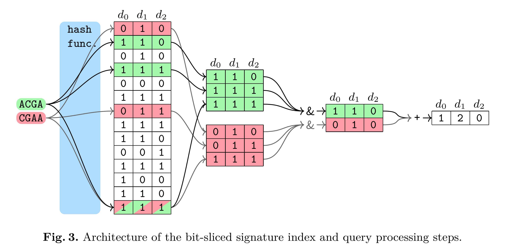

==========================================
COBS: A Compact Bit-Sliced Signature Index
==========================================

COBS (COmpact Bit-sliced Signature index) is a cross-over between an inverted
index and Bloom filters. Our target application is to index k-mers of DNA
samples or q-grams from text documents and process **approximate pattern
matching** queries on the corpus with a user-chosen coverage threshold. Query
results may contain a number of false positives which decreases exponentially
with the query length and the false positive rate of the index determined at
construction time. COBS' compact but simple data structure outperforms other
indexes in construction time and query performance with Mantis by Pandey et
al. in second place. However, unlike Mantis and other previous work, COBS does
not need the complete index in RAM and is thus designed to scale to larger
document sets.

More information about COBS is presented in `our current research paper <https://arxiv.org/abs/1905.09624>`_
Timo Bingmann, Phelim Bradley, Florian Gauger, and Zamin Iqbal.
"COBS: a Compact Bit-Sliced Signature Index".
In: *26th International Symposium on String Processing and Information Retrieval (SPIRE)*. pages 285-303. Spinger. October 2019.
preprint arXiv:1905.09624.

:ref:`See the tutorial page<tutorial>` on how to use COBS in python scripts.

Table of Contents
=================

.. toctree::
   :maxdepth: 2

   tutorial
   cobs_index
